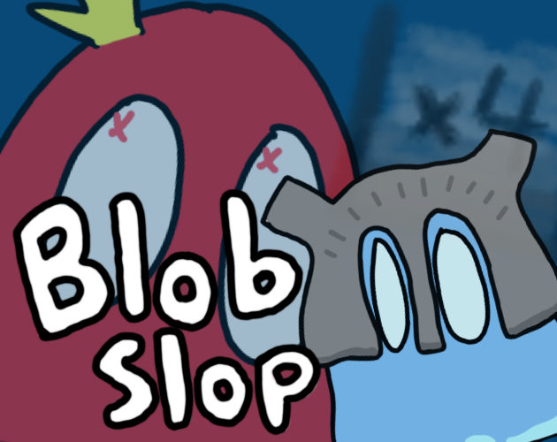

# Blob Slop

<p align="center">
  
</p>

A 3D endless-runner built in Godot 4.6 where you steer a growing swarm of blobs down a road, passing through math gates and fighting bosses across changing biomes.

## Gameplay

- **Steer** the swarm left and right with `A` / `D` or the arrow keys.
- **Run through gates** to grow or shrink your blob count: `+`, `-`, `×`, `÷`, `log`, `√`, and `RANDOM`.
- **Survive enemy blobs** that try to whittle the swarm down.
- **Defeat bosses** that interrupt the run, each with their own pool of attacks.
- **Push your high score** — it's saved between runs.

## Biomes

The procedural map cycles through several biomes, each with its own sky, fog, and decor:
Spring, Summer, Fall, Winter, and Cherry Blossoms.

## Play

Play it in the browser on itch.io: **[caffieno.itch.io/blob-slop](https://caffieno.itch.io/blob-slop)**

## Project layout

```
components/    Player, blobs, bosses, gates, chunks, projectiles, UI
game/          GameConfig, GameManager, and runtime managers (map gen, enemies)
data/biomes/   BiomeData resources for each biome
scenes/        Main scene and game-over screen
assets/        Meshes, materials, textures, SFX
music/         Background and game-over tracks
```

## Controls

| Action | Key |
| ------ | --- |
| Move left  | `A` or `←` |
| Move right | `D` or `→` |
| Start / restart | Any movement key |
